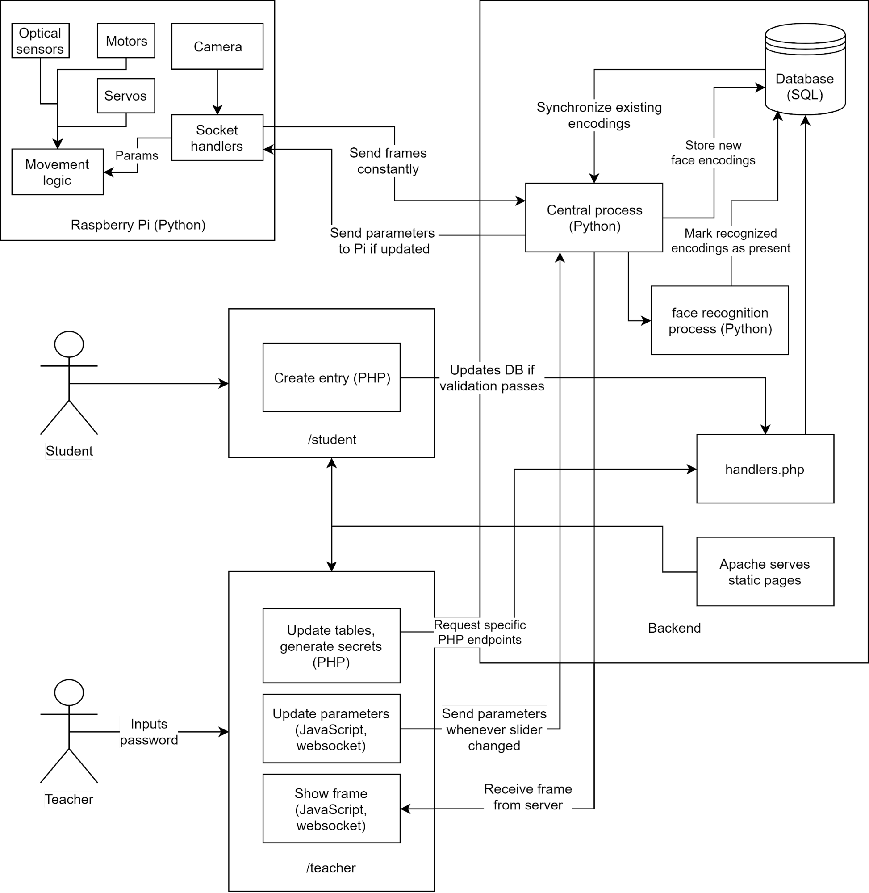

# Watch (me nae-nae) bot

Watch Bot is an automatic attendance taking solution to simplify keeping track of student presence in classroom and laboratory environments. It uses facial recognition to analyze images received from a camera module mounted on a robot controlled by a Raspberry Pi to update a remote database when it detects the presence of a registered student. All of the information on the database can be viewed and controlled by the instructor of the class using a web application, including a live feed of what the robot is capturing.

**Table of contents:**

- [Technologies/Concepts](#technologies/concepts)
- [Project Components](#project-components)
- [Overall Flow of Information](#overall-information-flow)
<!-- - Contributions section perhaps? -->

## Technologies/Concepts

### Technologies

- Raspberry Pi
- [`face_recognition` Python library](https://github.com/ageitgey/face_recognition)
- Unix virtual machine (server host)

### Concepts 

- Client-Server communication and processing
  - Sockets, Data I/O
- Database management
  - Polling
  - AJAX programming
- Facial recognition
- Motor control
- Sensor input processing

### Programming Languages Used

- Python
- JavaScript
- PHP
- HTML/CSS
- MySQL Server

## Project Components

The major components of this project are:

- [**Backend**](#backend)
  - [Server](#server)
  - [Raspberry Pi](#raspberry-pi)
- [**Website**](#website)
- [**Database**](#database)

### Backend

#### Server

Our server implementation uses two processes to enable our solution, processes SP1 and SP2.

|Process|Function|
|---|---|
|SP1| This is the main process on the server. It runs two threads: <br>  <ul>Facial recognition thread: Processes incoming frames once every second and perform the appropriate operations to generate/modify facial encodings.</ul><ul>Socket interface thread: Maintains the event loop and handles four socket connections, two with the Raspberry Pi and two with the client</ul>  |
|SP2| This is the polling process. It synchronizes the shared memory dictionary of student IDs and encodings, and also updates the SQL database with the encodings whenever necessary.|

<!-- This will be replaced by a diagram sometime in the future -->

```
|------------|<-- params --|----------|<-- params --|------------|
|     Pi     |             |    VM    |             |   Client   |
|------------|-- frames -->|----------|-- frames -->|------------|
```


#### Raspberry Pi

Similarly to the [server](#server), the Raspberry Pi also uses two process. They are processes RP1 and RP2.

|Process|Function|
|---|---|
|RP1| This is the main process on the Raspberry Pi. It runs two threads: <br>  <ul>Camera Module thread: Receives medium resolution frames from the camera using openCV and updates the image global variable.</ul><ul>Socket interface thread: Maintains the event loop and handles two socket connections, both from the server. It also updates the parameters to change the behavior of the robot defined on the web-app.</ul>  |
|RP2| This is the robot operation process. It uses the input from the optical sensors attached to the Raspberry Pi to ensure that the robot stays on the rails it is perched on.|


### Website

The website is hosted using an XAMPP installation on the virtual machine provided for this project. It consists of 3 pages: 

- Homepage for arbitrary information and appearance
- Student Registration page
- Teacher operation hub

#### Student page

The student page allows students to put in their student ID, name, photo, and a secret code (provided by the teacher) to register into the database. It is possible for students to re-register on the behest of the instructor if their image is not of high enough quality to recognize them.

Once the student registers, the database recognizes either a new entry or an update. The image is then gathered by the polling script and a facial encoding for the student is generated and stored in their database entry.


#### Teacher operation hub

The teacher hub will allow the teacher to:

- See the present members
- Set the parameters (speed of sweep and distance on track)
- Clear the attendance
- Generate new secrets (for student registration)
- Request that a student update their entry
- Display the camera feed
- View unclaimed secrets
- View currently registered students

It is password protected. Note that hovering over the names of any students will show the they submitted during registration.


### Database

The database is implemented using MySQL Server. The web-app always interacts with the database using AJAX requests with PHP endpoints. The backend interactions are done using Python scripts on the server by means of the MySQL Connector library.

Each student is registered in the `student_info` table with the following fields:

- Student Number (Primary key)
- Name
- Secret
- Facial Encoding
- Present (for current session)
- Path to the image they provided as stored on the virtual machine
- Valid photo (Boolean that the instructor can change to request the student to re-register)

#### How it's maintained

**Registration**: When a new student registers on the web-app, the database is updated with the appropriate information that the student provides. The server checks for new entries in the database at any time that have a `Valid` tag, therefore, when a student registers, the server calculates the facial encoding of the image provided during registration. The encoding is then added to a map of student ID and encoding key-value pairs in memory. Then it sends the new encoding and stores it as an encoded numpy array on the database for later use.

**Re-registration**: The teacher can review the images that the students have uploaded and set the `Valid` field to false using the `Request Update` field on the teacher hub. This is done in the event that the the teacher decides that a better quality image of the student is required for better facial recognition.


**Attendance**: The teacher can use the hub to:

- View a list of currently present students: This is done using AJAX requests to  get a list of all students with a 1 or `true` in the present field. The response is then construct a table using a helper function and insert the HTML to be viewer. This function is called every 3 seconds.
- Clear the attendance: This marks the Present field for all entries as 0 or false
- See a list of all students: The web-app sends requests at large intervals to fetch a list of all students registered in the database, present or not, which can be used to identify absentees.

## Overall Information Flow


